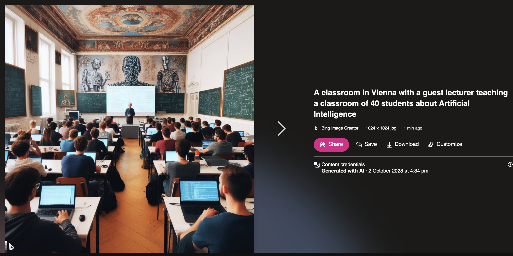
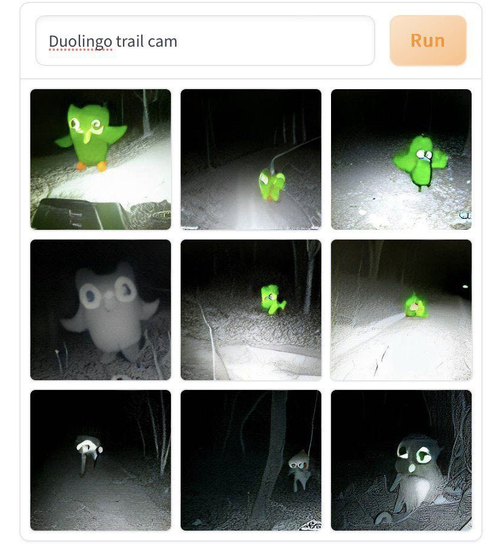
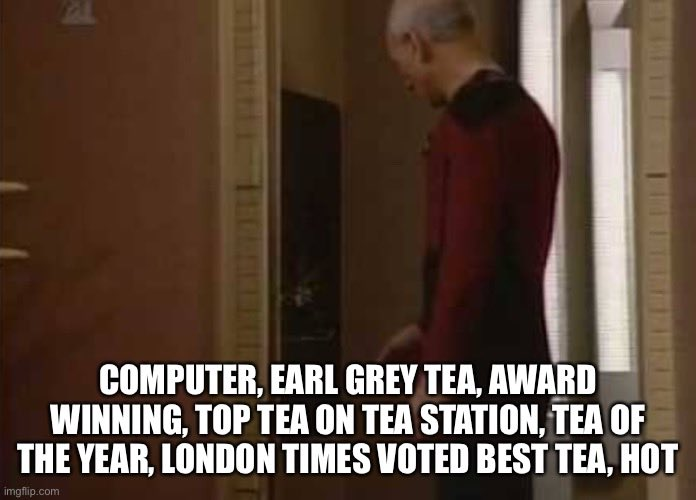

# Workshop: An introduction to generative models

## Overview
A 3-day introduction and hands-on workshop to the current state of generative AI models for text and 2-d images. Students will be shown various AI art projects that take imaginative and critical approaches to the field, and then transition to a hands-on workshop which allows them to experiment with the tech in a series of playful challenges.

# Day 1: Introduction

## Introduction: GANs, CLIP, and latent diffusion
+ GANs (Generative Adversarial Networks) as predecessor to diffusion models
    + [Sarah Friend - Perverse Affordances](https://www.art-gene.co.uk/sarah-friend-perverse-affordances/)
	+ [Memo Akten](https://www.memo.tv/)
	+ [Moreshshin Allahyari - Moon-Faced](https://morehshin.com/moonfaced/)
    + [ThisPersonDoesNotExist.com](https://thispersondoesnotexist.com/)
+ CLIP model can predict the most relevant text description for a given image
    + [Kate Crawford & Trevor Paglen - ImageNet Roulette](https://paglen.studio/2020/04/29/imagenet-roulette/)
    + [Recommended reading: Excavating AI by Crawford & Paglen](https://excavating.ai/)
    + [CLIP Interrogator](https://huggingface.co/spaces/pharma/CLIP-Interrogator)
+ Latent Diffusion in a nutshell starts a random (noise) image and then gradually adds details until it reaches a desired output (based on CLIP score)

## Workflows

+ [Dall-E 3 - OpenAI hates this one trick...](https://www.bing.com/images/create)
+ [MidJourney](https://www.midjourney.com/)
    + [MidJourney examples on Blue Shadow](https://www.blueshadow.art/midjourney-prompt-commands/)
+ Photoshop
+ Limitations of the above
+ Stable Diffusion
    + Automatic1111
    + InvokeAI

## Quick hands-on
+ [SD 2.1 txt2img on HuggingFace](https://huggingface.co/spaces/stabilityai/stable-diffusion)

## Setup Accounts
+ Create accounts/make sure everything works
    + [RunDiffusion.com](https://rundiffusion.com)
    + [OpenAI](https://openai.com)
    + [Bing Image Creator (Dall-E 3 for free)](https://www.bing.com/create)

## Some AI art galleries
+ [Lexica](https://lexica.art/)
+ [r/StableDiffusion](https://www.reddit.com/r/StableDiffusion/)
+ [r/MidJourney](https://www.reddit.com/r/midjourney/)
+ [r/dalle2](https://www.reddit.com/r/dalle2/)
+ [CivitAI (gallery but primarily a model database)](https://civitai.com/)

# Day 2: Deep dive into AI image generation

## Game/Exercise: Guess the Prompt
Reverse engineering image prompts (show an image, guess a prompt): Attempt to recreate an image as accurately as possible by coming up with a prompt for SD. The class will see the same image.

## Getting Started with A1111
Automatic1111, also known as Stable Diffusion Web UI, is an interface for stable diffusion based image generation models. Whereas Dall-E and MidJourney are closed, proprietary systems, "stable diffusion" is an open constellation of various interfaces and models. This makes it more complicated to use but much more powerful and versatile. SD is far more advanced than the others, including the ability to create video, run custom scripts, make seamless textures, and more.

+ Demonstration/How it works with hands-on learning
+ "Prompt engineering"

+ Seeds
+ Img2Img
+ Style Transfer
+ Inpainting
+ Models
+ Beyond (video, etc.)

## Stable Diffusion Examples
+ [Man simulates time travel thanks to Stable Diffusion image synthesis](https://arstechnica.com/information-technology/2022/12/man-simulates-time-travel-thanks-to-stable-diffusion-image-synthesis/)
	+ [Link to artist's instagram](https://www.instagram.com/stelfiett/)
+ [Mamadou Sow](https://www.instagram.com/p/Cru-6l0oc3X/?img_index=2)
+ [r/StableDiffusion](https://www.reddit.com/r/StableDiffusion/)
+ [block party](https://www.reddit.com/r/StableDiffusion/comments/14n83uz/block_party/) (embracing the glitches) (video)
+ [Holly Herndon](https://www.instagram.com/p/CoZnpIEI2cr/?hl=en)
+ [Marvel show "Secret Invasion" uses Stable Diffusion for opening credits](https://www.reddit.com/r/StableDiffusion/comments/14f2lxu/new_marvel_show_secret_invasion_uses_stable/)

## Free Discovery Time
Play around, ask questions, share results

Break

## Share-outs/Discussion
+ Deepfakes
+ ML art as theft/copyright concerns
+ Mat Dryhurt & Holly Herndon's [Have I Been Trained?](https://haveibeentrained.com/)

# Day 3: More Stable Diffusion
## Check-ins, discussion
This is a time to discuss any thoughts students have considered since yesterday, and to address any outstanding questions or concerns.

## Advanced Prompt Engineering
+ Prompt syntax
+ Negative words, adding weight, ordering, etc
+ [from:to:when]
+ [Helpful prompt engineering guide](https://prompthero.com/stable-diffusion-prompt-guide)
+ [Prompt syntax guide](https://github.com/AUTOMATIC1111/stable-diffusion-webui/wiki/Features#attentionemphasis)
+ [SD prompt templates](https://github.com/Dalabad/stable-diffusion-prompt-templates)
+ [InvokeAI official prompting guide](https://github.com/invoke-ai/InvokeAI/blob/main/docs/features/PROMPTS.md)

## Exercise: Precision
Given an image, students must faithfully reproduce it using prompt engineering (no inpainting allowed?)

## Video
Small demo of Deforum extension for A1111

## Break for Lunch

## Exercise: Intentional Image Creation
Produce 5~ original images given the following categories:
Organic, metal, abstract, architectural, portrait

## Break

## Share-outs, discussion

# Day 3: Large Language Models/ChatGPT

## Check-ins, discussion
This is a time to discuss any thoughts students have considered since yesterday, and to address any outstanding questions or concerns.

## Introduction to Large Language Models (LLMs)
+ Natural Language Processing (NLP)
+ Contemporary LLM applications
	+ Chatbots (including ChatGPT)
	+ Content generation
	+ Translation
	+ Art (show examples)
+ General vs fine-tuned

## Hands-on with ChatGPT 3.5
+ How it works
+ Styling ("in the style of")
+ Feedback
+ Role-playing
+ Strict parameters
	+ Exercise: Generate text using strong restrictions. Some ideas: "using only words without the letter 'e'", "respond only using emojis", "write as though you are out of breath and can only speak in short three or four word sentences"
		+ "Explain gravity, but write as though you are out of breath and can only speak in short three or four word sentences"
+ Other symbolic languages
	+ Emojis, "draw using ASCII", etc.

## Break for Lunch

## ChatGPT exercise
AI Collaborative Storytelling
+ Students work individually or in groups
+ Start a collaborative story in which each group writes a sentence or a short paragraph
+ After each contribution, they pass the story to ChatGPT to continue the narrative
+ Continue this process, alternating between human contributions and AI-generated text
+ Afterwards, we discuss the evolving story, the blend of human and AI creativity, and any surprising elements

## Discussion
+ What it won't do
+ Do Anything Now (DAN) ChatGPT hacks
	+ [List of ChatGPT jailbreaks](https://gist.github.com/coolaj86/6f4f7b30129b0251f61fa7baaa881516#chat-gpt-dan-and-other-jailbreaks)

## Break

## Exercise
In groups of 2-4 people, use ChatGPT and Stable Diffusion together to create a vision of the future. This can take the form of a speculative film (trailer, poster, whatever), a dystopic advertising campaign, a fashion line for robot babies, an insurrectionist revolutionary political campaign flyer set in 2058, or anything else you feel like.

## Some more tools, art, and things to be aware of
A brief presentation of AI tools, etc. that you might find interesting, which you can research further in your own time.
+ [OpArt in Stable Diffusion](https://weirdwonderfulai.art/tutorial/spiral-optical-illusion-image-generation-stable-diffusion/)

## Goodbye for now, share-outs, last thoughts

